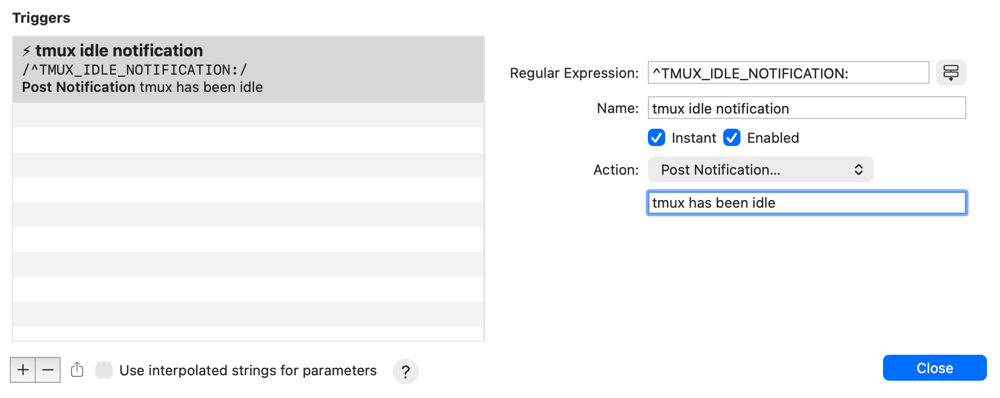

# tmux-idle-notification

[](https://opensource.org/licenses/MIT)
[](https://github.com/s2atoru/claude-tmux-idle-notification-hook/stargazers)
[](https://github.com/s2atoru/claude-tmux-idle-notification-hook/network)
[](https://github.com/s2atoru/claude-tmux-idle-notification-hook/issues)

iTerm2とtmuxでアイドル状態を検出し、macOS通知を送信するシステムです。


## 目次

- [概要](#概要)
- [機能](#機能)
- [ファイル構成](#ファイル構成)
- [クイックスタート](#クイックスタート)
- [セットアップ](#セットアップ)
- [使い方](#使い方)
- [スクリプト詳細](#スクリプト詳細)
- [通知の仕組み](#通知の仕組み)
- [トラブルシューティング](#トラブルシューティング)
- [カスタマイズ](#カスタマイズ)
- [今後の改善案](#今後の改善案)
- [貢献](#貢献)
- [ライセンス](#ライセンス)
- [作者](#作者)
- [参考資料](#参考資料)

## 概要

このプロジェクトは2つの通知システムを提供します：

1. **tmuxアイドル監視** - tmuxセッションがアイドル状態になったときに通知
2. **Claude Code完了通知** - Claude Codeがタスクを完了したときに通知

どちらもiTerm2の`TMUX_IDLE_NOTIFICATION:`プレフィックスを使用して、macOS通知センターに通知を表示します。

### 動作イメージ

```
┌─────────────────────────────────────────────────────────────┐
│                    tmux + iTerm2                            │
│                                                             │
│  ┌──────────────────┐                                      │
│  │  tmux session    │                                      │
│  │  (idle 60s+)     │                                      │
│  └────────┬─────────┘                                      │
│           │                                                 │
│           ▼                                                 │
│  ┌──────────────────┐       ┌──────────────────┐          │
│  │ tmux-idle-check  │──────▶│ TMUX_IDLE_       │          │
│  │     .sh          │       │ NOTIFICATION:    │          │
│  └──────────────────┘       └────────┬─────────┘          │
│                                       │                     │
│           Claude Code                 │                     │
│  ┌──────────────────┐                │                     │
│  │  Task completed  │                │                     │
│  │  (idle 60s+)     │                │                     │
│  └────────┬─────────┘                │                     │
│           │                           │                     │
│           ▼                           │                     │
│  ┌──────────────────┐                │                     │
│  │claude-complete-  │────────────────┘                     │
│  │   notify.sh      │                                      │
│  └──────────────────┘                                      │
│                                                             │
│                           │                                 │
│                           ▼                                 │
│                  ┌─────────────────┐                       │
│                  │  iTerm2 detects │                       │
│                  │  prefix pattern │                       │
│                  └────────┬────────┘                       │
└───────────────────────────┼─────────────────────────────────┘
                            │
                            ▼
                   ┌─────────────────┐
                   │  macOS           │
                   │  Notification    │
                   │  Center          │
                   └─────────────────┘
```

## 機能

### 1. tmuxアイドル監視

- tmuxセッションの最終アクティビティを監視
- 指定時間（デフォルト60秒）アイドル状態が続くと通知
- アクティブに戻ると通知フラグをリセット
- セッション単位で動作

### 2. Claude Code完了通知

- Claude Codeがタスク完了後、60秒間アイドル状態になると通知
- Claude Code hookシステムと統合
- tmux環境でのみ動作（現在の実装）

## ファイル構成

```
tmux-idle-notification/
├── README.md                          # このファイル
├── tmux-idle-check.sh                 # アイドル監視メインスクリプト
└── tmux-idle-check-launcher.sh        # ランチャースクリプト

~/.local/bin/
└── claude-complete-notify.sh          # Claude Code hook用スクリプト

~/.claude/
└── settings.json                       # Claude Code設定ファイル
```

## クイックスタート

```bash
# リポジトリをクローン
git clone https://github.com/s2atoru/claude-tmux-idle-notification-hook.git
cd claude-tmux-idle-notification-hook

# スクリプトをインストール
mkdir -p ~/.local/bin
cp tmux-idle-check.sh tmux-idle-check-launcher.sh claude-complete-notify.sh ~/.local/bin/
chmod +x ~/.local/bin/{tmux-idle-check.sh,tmux-idle-check-launcher.sh,claude-complete-notify.sh}

# Claude Code設定をマージ
cat claude-settings-example.json >> ~/.claude/settings.json

# tmux設定に追加（オプション）
echo "set-hook -g after-new-session 'run-shell \"~/.local/bin/tmux-idle-check-launcher.sh\"'" >> ~/.tmux.conf

# tmux設定をリロード
tmux source-file ~/.tmux.conf
```

完了！tmuxセッションでアイドル状態になると通知が届きます。

## セットアップ

### 前提条件

- macOS
- iTerm2（通知機能に必要）
- tmux
- Claude Code（Claude Code通知機能を使う場合）

### インストール

#### 1. tmuxアイドル監視のセットアップ

```bash
# スクリプトを実行可能にする
chmod +x tmux-idle-check.sh
chmod +x tmux-idle-check-launcher.sh

# スクリプトを~/.local/binにコピー（オプション）
mkdir -p ~/.local/bin
cp tmux-idle-check.sh ~/.local/bin/
cp tmux-idle-check-launcher.sh ~/.local/bin/
```

#### 2. Claude Code通知のセットアップ

```bash
# スクリプトを~/.local/binに配置
chmod +x claude-complete-notify.sh
cp claude-complete-notify.sh ~/.local/bin/

# Claude Code設定にhookを追加
# ~/.claude/settings.jsonに以下を追加：
```

```json
{
  "hooks": {
    "Notification": [
      {
        "matcher": "idle_prompt",
        "hooks": [
          {
            "type": "command",
            "command": "/home/sugimoto/.local/bin/claude-complete-notify.sh"
          }
        ]
      }
    ]
  }
}
```

### iTerm2設定

このシステムはiTerm2のTrigger機能を使用してmacOS通知を表示します。以下の手順で設定してください。

#### 1. Triggerの設定

1. iTerm2を開く
2. **iTerm2 > Settings > Profiles** を開く
3. 使用しているプロファイルを選択
4. **Advanced** タブをクリック
5. **Triggers** セクションの **Edit** ボタンをクリック
6. 左下の **+** ボタンで新しいTriggerを追加
7. 以下のように設定：

| 項目 | 設定値 |
|------|--------|
| Regular Expression | `^TMUX_IDLE_NOTIFICATION:` |
| Name | `tmux idle notification` |
| Action | `Post Notification...` |
| Parameters | `tmux has been idle` (または任意のメッセージ) |
| Instant | ✅ チェック |
| Enabled | ✅ チェック |

8. **Close** をクリックして保存



#### 2. 通知権限の確認

macOSのシステム設定で、iTerm2の通知が許可されていることを確認：

1. **システム設定 > 通知** を開く
2. **iTerm2** を選択
3. **通知を許可** がオンになっていることを確認
4. 通知スタイルを **バナー** または **通知** に設定

## 使い方

### tmuxアイドル監視

#### 自動起動（推奨）

`.tmux.conf`に以下を追加して、tmux起動時に自動実行：

```bash
# tmux起動時にアイドルチェックを開始
set-hook -g after-new-session 'run-shell "~/.local/bin/tmux-idle-check-launcher.sh"'
```

#### 手動起動

```bash
# ランチャー経由で起動（重複起動を防ぐ）
~/.local/bin/tmux-idle-check-launcher.sh

# または直接起動
nohup ~/.local/bin/tmux-idle-check.sh > /dev/null 2>&1 &
```

#### プロセス確認

```bash
# 実行中のアイドルチェックプロセスを確認
pgrep -f "tmux-idle-check.sh"

# プロセス詳細を確認
ps aux | grep tmux-idle-check
```

### Claude Code通知

Claude Codeで作業を完了後、60秒間何も入力しないと自動的に通知が届きます。

#### 手動テスト

```bash
# tmux内で実行
/home/sugimoto/.local/bin/claude-complete-notify.sh
```

macOS通知が表示されれば正常に動作しています。

## スクリプト詳細

### tmux-idle-check.sh

tmuxセッションの最終アクティビティを監視するメインスクリプト。

**設定可能なパラメータ:**

- `IDLE_THRESHOLD`: アイドル判定時間（秒）デフォルト: 60秒
- `sleep`: チェック間隔（秒）デフォルト: 30秒

**動作:**

1. 30秒ごとにtmuxセッションのアクティビティをチェック
2. 60秒以上アイドル状態が続くと通知
3. アクティブに戻るとフラグをリセット
4. セッションが終了すると自動終了

### tmux-idle-check-launcher.sh

アイドルチェックスクリプトの重複起動を防ぐランチャー。

**動作:**

1. 既に起動中かチェック（`pgrep`を使用）
2. 起動していなければ`nohup`で独立プロセスとして起動
3. `disown`でシェルから切り離し

### claude-complete-notify.sh

Claude Code hook用の通知スクリプト。

**動作:**

- tmux環境内: 現在のペインに`TMUX_IDLE_NOTIFICATION:`を送信
- tmux外: `echo`で出力（現在は通知されない）

**環境検出:**

- `$TMUX`環境変数の有無でtmux環境を判定
- 現在のペインIDを自動取得

## 通知の仕組み

### TMUX_IDLE_NOTIFICATION: プレフィックス

iTerm2はtmuxの`display-message`出力を監視し、`TMUX_IDLE_NOTIFICATION:`プレフィックスを検出すると自動的にmacOS通知に変換します。

**例:**

```bash
tmux display-message -t $PANE_ID "TMUX_IDLE_NOTIFICATION: Session idle for 1 minutes"
```

↓

macOS通知センターに「Session idle for 1 minutes」が表示される

## トラブルシューティング

### 通知が届かない

**原因1: iTerm2を使用していない**
- 解決策: iTerm2でtmuxを起動してください

**原因2: tmux環境ではない**
- 解決策: tmux内でスクリプトを実行してください

**原因3: macOS通知設定**
- 解決策: システム環境設定 > 通知 > iTerm2で通知が有効か確認

### アイドルチェックが動作しない

**原因1: プロセスが起動していない**

```bash
# プロセス確認
pgrep -f "tmux-idle-check.sh"

# 再起動
~/.local/bin/tmux-idle-check-launcher.sh
```

**原因2: セッション名が取得できない**

```bash
# 現在のセッション名を確認
tmux display-message -p '#S'
```

### Claude Code通知が動作しない

**原因1: hook設定が反映されていない**

```bash
# Claude Code設定を確認
cat ~/.claude/settings.json

# Claude Codeを再起動
```

**原因2: スクリプトの実行権限がない**

```bash
# 実行権限を付与
chmod +x ~/.local/bin/claude-complete-notify.sh
```

**原因3: スクリプトパスが間違っている**

```bash
# パスを確認
ls -la ~/.local/bin/claude-complete-notify.sh
```

## カスタマイズ

### アイドル時間を変更

`tmux-idle-check.sh`の`IDLE_THRESHOLD`を編集：

```bash
# 例: 120秒（2分）に変更
IDLE_THRESHOLD=120
```

### 通知メッセージを変更

各スクリプトの`tmux display-message`コマンドのメッセージ部分を編集：

```bash
# 例:
tmux display-message -t "$PANE_ID" "TMUX_IDLE_NOTIFICATION: カスタムメッセージ"
```

### チェック間隔を変更

`tmux-idle-check.sh`の`sleep`を編集：

```bash
# 例: 10秒ごとにチェック
sleep 10
```

## 今後の改善案

### Claude Code通知の改善

現在の`claude-complete-notify.sh`はtmux環境でのみ動作します。以下の環境にも対応する改善案があります：

| 環境 | 現状 | 改善案 |
|------|------|--------|
| tmux + iTerm2 | ✅ 動作中 | `TMUX_IDLE_NOTIFICATION:` |
| iTerm2のみ | ❌ 未対応 | エスケープシーケンス `\e]9;メッセージ\a` |
| その他 | ❌ 未対応 | `osascript` で直接通知 |

> 💡 **計画ドキュメント**: 詳細な実装計画は [Plans](/.claude/plans/) を参照してください。

## 貢献

貢献を歓迎します！以下の方法で参加できます：

1. 🐛 **バグ報告**: [Issues](https://github.com/s2atoru/claude-tmux-idle-notification-hook/issues) で報告
2. 💡 **機能リクエスト**: [Issues](https://github.com/s2atoru/claude-tmux-idle-notification-hook/issues) で提案
3. 🔧 **プルリクエスト**: 改善を直接提出
4. ⭐ **スター**: プロジェクトが役立ったらスターをお願いします

### 開発ガイドライン

- コードスタイル: ShellCheck準拠
- コミットメッセージ: [Conventional Commits](https://www.conventionalcommits.org/)形式
- テスト: 変更前後でスクリプトをテスト実行

## ライセンス

MIT License

## 作者

sugimoto

[@s2atoru](https://github.com/s2atoru)

## 参考資料

- [iTerm2 Proprietary Escape Codes](https://iterm2.com/documentation-escape-codes.html)
- [tmux man page](https://man.openbsd.org/tmux)
- [Claude Code Documentation](https://code.claude.com/docs)
